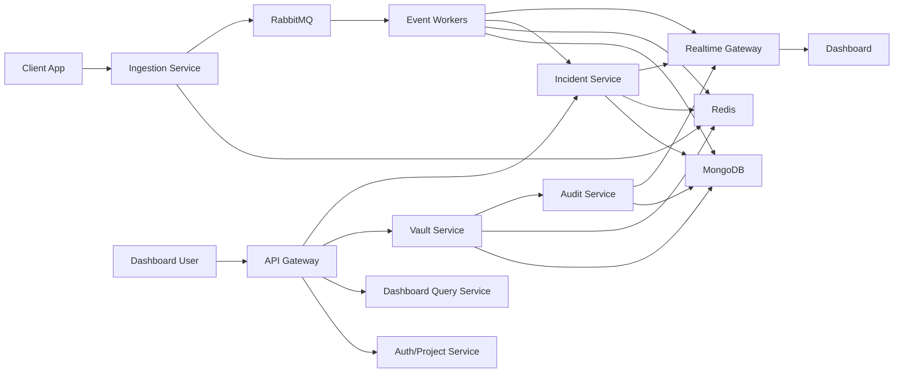

# PulseOps Architecture Overview

## System Style

PulseOps uses a microservices-first architecture in a TypeScript monorepo. For MVP speed, some services may run as separate Express apps or grouped runtime processes, but each domain keeps clear ownership of APIs, data, queue contracts, and failure behavior.

## High-Level Components

| Component | Responsibility | Core Tech |
| --- | --- | --- |
| Dashboard | Developer UI for projects, telemetry, incidents, workers, queues, and vault | React/Next.js, Tailwind, Socket.IO client, Recharts |
| API Gateway | Public HTTP entrypoint, auth middleware, request routing, redaction, request logs | Express, TypeScript |
| Auth/Project Service | Users, sessions, projects, API keys, ownership checks | Express, MongoDB, Redis |
| Ingestion Service | Validates API keys, rate limits, idempotency, publishes telemetry messages | Express, Redis, RabbitMQ |
| Event Worker Service | Consumes logs/errors/metrics, persists events, updates hot counters | Node.js workers, RabbitMQ, MongoDB, Redis |
| Incident Service | Evaluates rules, deduplicates incidents, manages lifecycle | Express/worker, MongoDB, Redis |
| Dashboard Query Service | Read-optimized dashboard APIs and cache-aside summaries | Express, MongoDB, Redis |
| Realtime Gateway | Socket.IO rooms by project and environment, emits live updates | Socket.IO, Redis adapter optional |
| Vault Service | Secret encryption, reveal, token validation, external fetch APIs | Express, MongoDB, Redis, crypto |
| Audit Service | Durable audit events for vault and sensitive operations | Worker/service, RabbitMQ, MongoDB |
| Ops Service | Worker health, queue stats, service health endpoints | Express/worker, MongoDB, Redis, RabbitMQ management API optional |

## Runtime Topology

## Core Data Flow

1. A dashboard user authenticates and creates a project.
2. The project service creates an API key, stores only the hash, and returns the raw value once.
3. A client app sends telemetry with `x-api-key` and optional `idempotency-key`.
4. The ingestion service validates the key with Redis cache-aside, applies rate limits and idempotency, then publishes to RabbitMQ.
5. Workers consume messages, persist normalized events, update Redis hot metrics, and request incident evaluation.
6. Incident logic uses Redis time-window counters and MongoDB incident records to create or deduplicate incidents.
7. Dashboard APIs read MongoDB plus Redis caches.
8. Realtime gateway emits project-scoped updates to connected dashboard clients.

## Service Boundary Rule

Each service owns its writes. Other services may read only through:

- that service's HTTP API
- an explicitly planned query/read model
- immutable event payloads sent through RabbitMQ

No service should casually import another service's model and write its collections.

## MVP Deployment Simplification

Allowed runtime grouping for early implementation:

- `api-gateway`, `auth-project`, `dashboard-query`, and `incident-api` can run in one Express process named `api`.
- `event-workers`, `incident-worker`, `audit-worker`, and `ops-heartbeat` can run in one worker process.
- `vault-service` should remain logically separate and may become its own process early because it has sensitive security rules.

The docs still treat them as separate services so the architecture can scale without redesign.

## Primary Tradeoffs

| Decision | Benefit | Cost |
| --- | --- | --- |
| Express TypeScript over NestJS | Faster, familiar, explicit control | More manual structure and conventions |
| RabbitMQ over Kafka | Local-friendly, clear retry/DLQ behavior | Less impressive for streaming scale than Kafka |
| MongoDB for events | Flexible telemetry payloads and quick iteration | Requires careful indexing and retention |
| Redis for hot state | Fast counters, rate limits, idempotency | Must define fallback behavior when unavailable |
| Vault inside PulseOps | Strong security demo | Must avoid pretending to be enterprise Vault |

## Quality Bar

The architecture is successful if a reviewer can trace one telemetry event from HTTP ingestion through rate limit, idempotency, queue publish, worker processing, MongoDB persistence, Redis counter update, incident detection, and live dashboard update.
